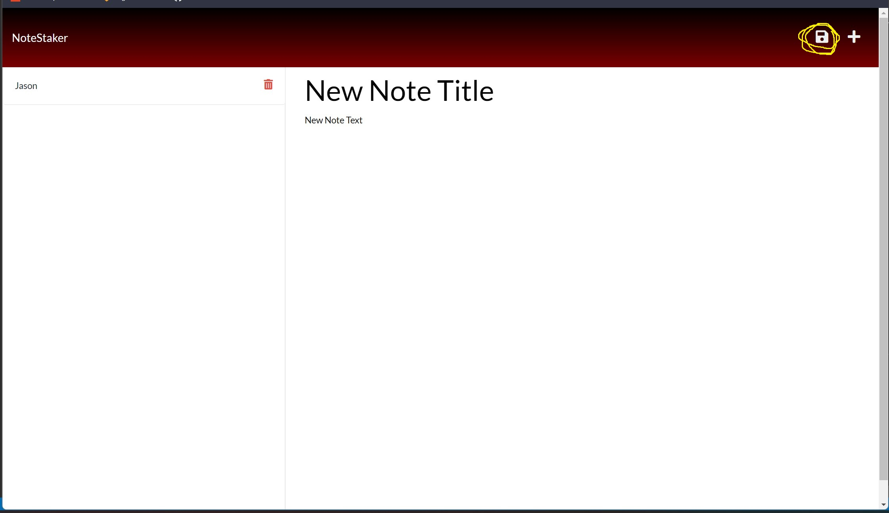

  
  <h1 align="center">NoteStaker<h1>

  

  ## TABLE OF CONTENTS
  - [Description](#description)
  - [Installation](#Installation)
  - [Usage](#Usage)
  - [Tests](#Tests)
  - [License](#License)
  - [Contributors](#Contributors)
  - [Credits](#Credits)
  - [Questions](#Questions)

  ## DESCRIPTION
  Application to representing a Digital Notebook where the user can write and save notes.
  
  ## Application Deployment Links:

  [The NoteStaker](https://radiant-thicket-41331.herokuapp.com/)

  ## INSTALLATION
  To install the application to view the code:

  ##### From GitHub:

  In your terminal:  
  `git clone <SSH URL Link Here>`  
  `code .`

  ## MEDIA
  #### Screenshot of App User Interface and Save Note Button
  

   #### Screenshot of App User Interface and Delete Note Button
  
  
  ## LICENSE
  Project developed 2022 by Jason Steer, 
  This application is licensed under the Apache 2.0 license.

  ## QUESTIONS
  For any questions on this project please contact me via my Github link or email. 

  **Find me on GitHub - UserName:** [eljsteer](https://github.com/eljsteer) 
  **Email me with any questions:** el.jsteer@gmail.com 
   
  
  _This README was generated with ❤️ by [LA-README-ZY](https://github.com/eljsteer/LA-README-ZY)_
